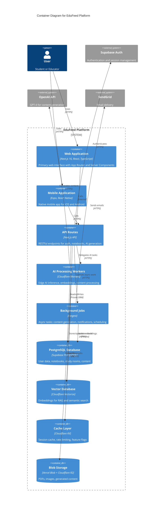

# C4 Container Diagram

*Auto-generated by Intelligent Analyzer*

```mermaid
C4Container
    title Container Diagram for EduFeed Platform

    Person(user, "User", "Student or Educator")

    System_Boundary(edufeed, "EduFeed Platform") {
        Container(webapp, "Web Application", "Next.js 16, React, TypeScript", "Primary web interface with App Router and Server Components")
        Container(mobileapp, "Mobile Application", "Expo, React Native", "Native mobile app for iOS and Android")
        Container(apiRoutes, "API Routes", "Next.js API", "RESTful endpoints for auth, notebooks, AI generation")
        Container(workers, "AI Processing Workers", "Cloudflare Workers", "Edge AI inference, embeddings, content processing")
        Container(bgJobs, "Background Jobs", "Inngest", "Async tasks: content generation, notifications, scheduling")
        ContainerDb(postgres, "PostgreSQL Database", "Supabase PostgreSQL", "User data, notebooks, study rooms, content")
        ContainerDb(vectorDb, "Vector Database", "Cloudflare Vectorize", "Embeddings for RAG and semantic search")
        ContainerDb(cache, "Cache Layer", "Cloudflare KV", "Session cache, rate limiting, feature flags")
        ContainerDb(blobStorage, "Blob Storage", "Vercel Blob + Cloudflare R2", "PDFs, images, generated content")
    }

    System_Ext(supabase, "Supabase Auth", "Authentication and session management")
    System_Ext(openai, "OpenAI API", "GPT-4 for content generation")
    System_Ext(sendgrid, "SendGrid", "Email delivery")

    Rel(user, webapp, "Uses", "HTTPS")
    Rel(user, mobileapp, "Uses", "HTTPS")
    Rel(webapp, apiRoutes, "Calls", "Internal")
    Rel(mobileapp, apiRoutes, "Calls", "HTTPS")
    Rel(apiRoutes, postgres, "Reads/Writes", "Prisma ORM")
    Rel(apiRoutes, supabase, "Authenticates", "HTTPS")
    Rel(apiRoutes, workers, "Delegates AI tasks", "HTTPS")
    Rel(apiRoutes, bgJobs, "Queues async work", "HTTPS")
    Rel(workers, vectorDb, "Stores/queries embeddings", "HTTPS")
    Rel(workers, openai, "Generates content", "HTTPS")
    Rel(bgJobs, sendgrid, "Sends emails", "HTTPS")
    Rel(bgJobs, postgres, "Updates state", "Prisma")
    Rel(apiRoutes, blobStorage, "Stores files", "HTTPS")
    Rel(workers, cache, "Caches results", "HTTPS")
```