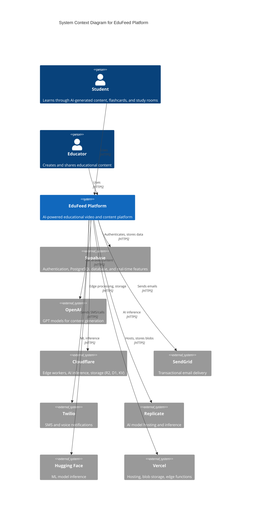

# C4 Context Diagram

*Auto-generated by Intelligent Analyzer*

```mermaid
C4Context
    title System Context Diagram for EduFeed Platform

    Person(student, "Student", "Learns through AI-generated content, flashcards, and study rooms")
    Person(educator, "Educator", "Creates and shares educational content")

    System(edufeed, "EduFeed Platform", "AI-powered educational video and content platform")

    System_Ext(supabase, "Supabase", "Authentication, PostgreSQL database, and real-time features")
    System_Ext(openai, "OpenAI", "GPT models for content generation")
    System_Ext(cloudflare, "Cloudflare", "Edge workers, AI inference, storage (R2, D1, KV)")
    System_Ext(sendgrid, "SendGrid", "Transactional email delivery")
    System_Ext(twilio, "Twilio", "SMS and voice notifications")
    System_Ext(replicate, "Replicate", "AI model hosting and inference")
    System_Ext(huggingface, "Hugging Face", "ML model inference")
    System_Ext(vercel, "Vercel", "Hosting, blob storage, edge functions")

    Rel(student, edufeed, "Uses", "HTTPS")
    Rel(educator, edufeed, "Uses", "HTTPS")
    Rel(edufeed, supabase, "Authenticates, stores data", "HTTPS")
    Rel(edufeed, openai, "Generates content", "HTTPS")
    Rel(edufeed, cloudflare, "Edge processing, storage", "HTTPS")
    Rel(edufeed, sendgrid, "Sends emails", "HTTPS")
    Rel(edufeed, twilio, "Sends SMS/calls", "HTTPS")
    Rel(edufeed, replicate, "AI inference", "HTTPS")
    Rel(edufeed, huggingface, "ML inference", "HTTPS")
    Rel(edufeed, vercel, "Hosts, stores blobs", "HTTPS")
```