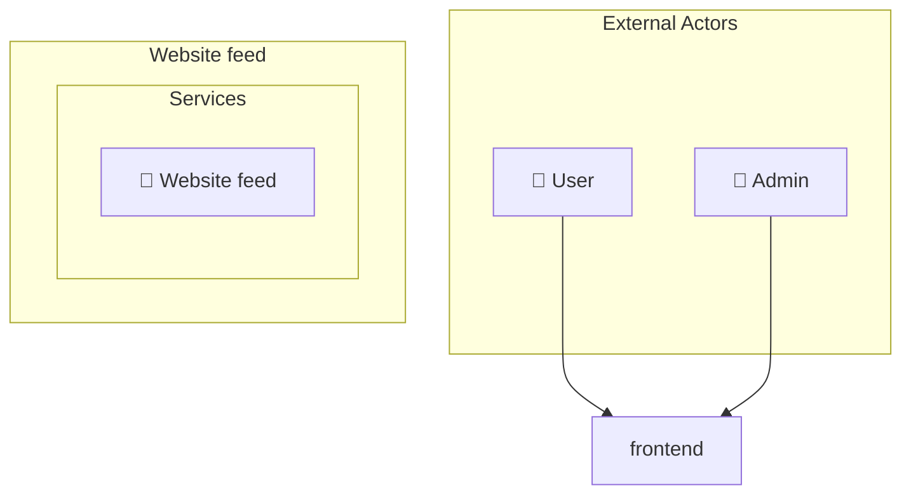

# System Architecture

*C4-style system context diagram*

```mermaid
flowchart TB
    subgraph external["External Actors"]
        user["👤 User"]
        admin["👤 Admin"]
    end

    subgraph system["Website feed"]
        subgraph services["Services"]
            Website_feed["🔧 Website feed"]
        end
    end

    user --> frontend
    admin --> frontend
```
