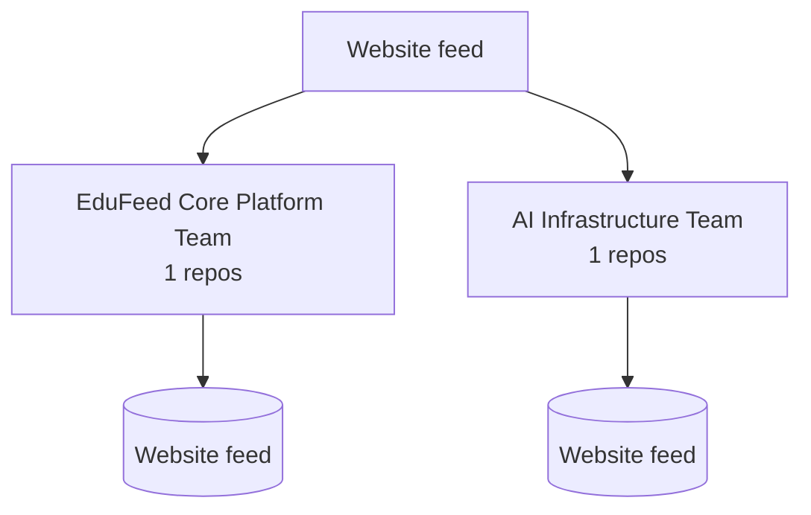

# Team Organization

*Team structure with repository ownership*

```mermaid
flowchart TB
    org["Website feed"]
    EduFeed_Core_Platform_Team["EduFeed Core Platform Team<br/>1 repos"]
    org --> EduFeed_Core_Platform_Team
    EduFeed_Core_Platform_Team_Website_feed[("Website feed")]
    EduFeed_Core_Platform_Team --> EduFeed_Core_Platform_Team_Website_feed
    AI_Infrastructure_Team["AI Infrastructure Team<br/>1 repos"]
    org --> AI_Infrastructure_Team
    AI_Infrastructure_Team_Website_feed[("Website feed")]
    AI_Infrastructure_Team --> AI_Infrastructure_Team_Website_feed
```
