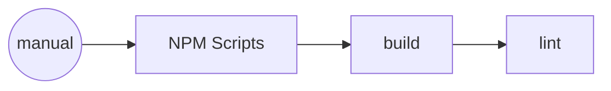

# CI/CD Pipeline Documentation

*Generated: 12/30/2025 | Pipelines: 1*

## Overview

| Pipeline | Provider | Triggers | Jobs |
|----------|----------|----------|------|
| NPM Scripts | npm | manual | 2 |

## Pipeline Details

### NPM Scripts

**Provider**: npm
**File**: `package.json`

**Triggers**:

- manual

**Jobs/Steps**:

- **build**: prisma generate && next build
- **lint**: eslint .

## Pipeline Flow

---
*Last updated: 2025-12-31T04:51:02.212Z*