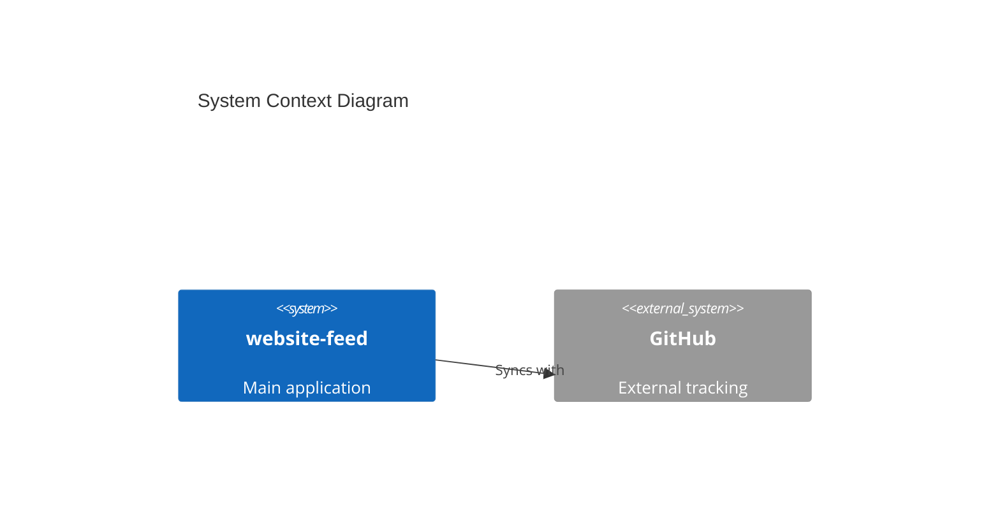
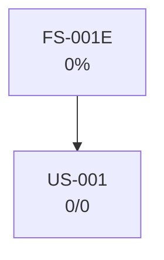

# Architecture Map

*Generated: 12/30/2025*

## System Context

```mermaid
C4Context
    title System Context Diagram

    System(main, "website-feed", "Main application")
    System_Ext(github, "GitHub", "External tracking")
    Rel(main, github, "Syncs with")
```

## Module Dependencies

```mermaid
graph LR
    no_modules[No modules analyzed]
```

## Feature Hierarchy

```mermaid
graph TD
    FS_001E["FS-001E<br/>0%"]
    FS_001E --> US_001["US-001<br/>0/0"]
```

---
*Last updated: 2025-12-31T04:51:02.207Z*