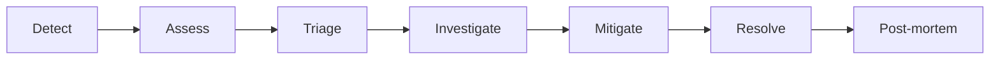

# Incident Management

*Generated: 12/30/2025*

## Incident Response Process

## Incident Severity Levels

| Level | Description | Response | Examples |
|-------|-------------|----------|----------|
| SEV1 | Critical - Complete outage | Immediate, all hands | Service unreachable |
| SEV2 | Major - Partial outage | < 30 min, on-call | Degraded performance |
| SEV3 | Minor - Limited impact | < 4 hours | Feature unavailable |
| SEV4 | Low - Minimal impact | Next business day | Minor bug |

## Incident Template

### Incident Report: [TITLE]

**Date**: YYYY-MM-DD
**Severity**: SEV[1-4]
**Duration**: X hours
**Impact**: [Description of impact]

#### Timeline

| Time | Event |
|------|-------|
| HH:MM | Issue detected |
| HH:MM | Investigation started |
| HH:MM | Root cause identified |
| HH:MM | Mitigation applied |
| HH:MM | Resolved |

#### Root Cause

[Description of root cause]

#### Resolution

[Description of how it was resolved]

#### Action Items

- [ ] Prevent recurrence
- [ ] Improve detection
- [ ] Update documentation

## Post-Mortem Process

1. Schedule post-mortem within 48 hours
2. Gather all participants
3. Review timeline and facts
4. Identify root causes (5 Whys)
5. Define action items
6. Document and share learnings

---
*Last updated: 2025-12-31T04:51:02.273Z*